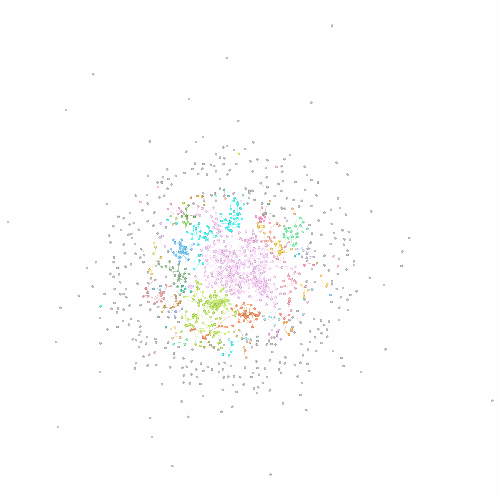

# Black Hole Strategy in Metal-Organic Framework (MOF) Graph

    

# Black Hole Strategy for Node Removal

## Overview
This repository contains a Python-based implementation of the **Black Hole Strategy** applied to community detection in networks. The main goal is to identify and remove nodes from a graph based on a gravity metric, which takes into account degree centrality, betweenness centrality, and edge weights. The method allows for the removal of a percentage of nodes with the lowest gravity in each community based on a specified threshold.

## Demo!
Below is an example of the **Black Hole Strategy** in action, showing the graph as nodes are highlighted based on their gravity:

The strategy works as follows:

1. **Community Detection**: First, the graph is divided into communities using the **Girvan-Newman algorithm**.
2. **Gravity Calculation**: For each community, the gravity is computed using normalized **degree**, **betweenness centrality**, and the **weights of connected edges** for each node.
3. **Node Removal**: Nodes with the lowest gravity are removed based on a configurable **threshold**, representing the percentage of nodes to be removed in each community.
4. **Results**: The remaining nodes are analyzed, and the reduced graph is visualized.

## How it Works

1. **Loading Data**: The edge list of the graph and node summary data are loaded.
2. **Community Detection**: Communities are detected using the **Girvan-Newman algorithm**, and each node is assigned a community ID.
3. **Centrality Calculation**: For each community, the gravity is computed using normalized centrality measures.
4. **Black Hole Strategy**: A user-defined percentage of nodes with the lowest gravity is removed from each community.
5. **Visualization**: The graph is visualized before and after node removal, with each community in a different color.

## MOFGalaxyNet and Black Hole Strategy
- **MOFGalaxyNet:**
    
To access the related code for MOFGalaxyNet, visit the following GitHub repository:

    <a href="https://github.com/MehrdadJalali-KIT/MOFGalaxyNet">MOFGalaxyNet GitHub Repository</a>

