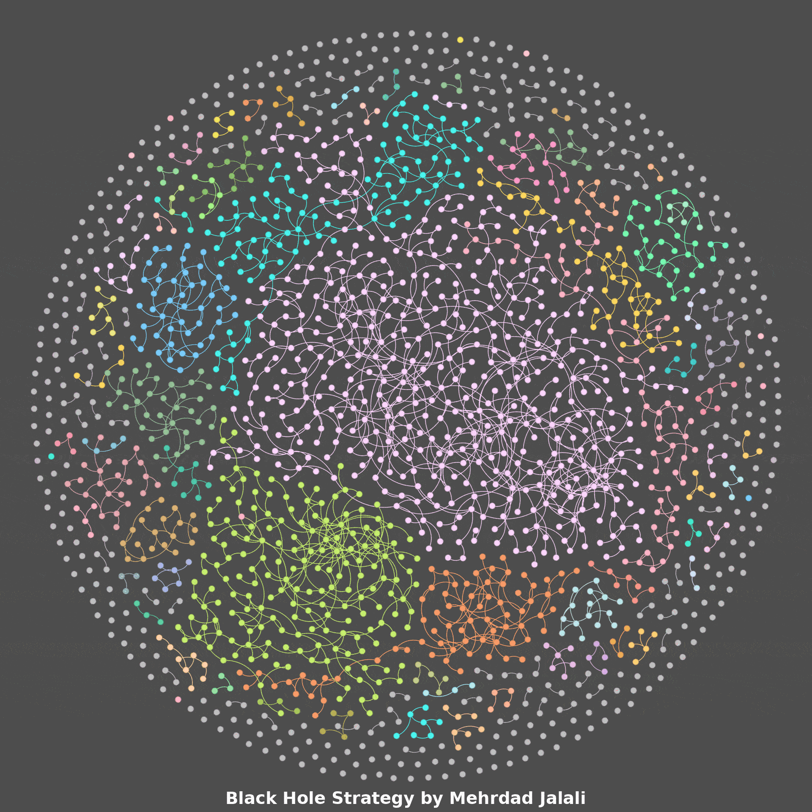

# Black Hole Strategy in Metal-Organic Framework (MOF) Graph

<div align="center">
    
</div>

This repository implements the **Bootstrapped Black Hole Strategy** for sparsifying Metal-Organic Framework (MOF) networks and evaluating them using a custom GraphSAGE model. It processes MOF data from `MOFGalaxyNet.csv` (829,300 edges) and `MOFCSD.csv` (12,561 nodes), generating features (Morgan fingerprints, pore diameters, metal types) and training a GraphSAGE model to classify MOFs by pore size (nonporous, small, medium, large). The goal is to achieve test accuracy >0.5, matching a previous version without edge weights.

## Black Hole Strategy for Node Removal

### Overview
This project provides a Python-based implementation of the **Black Hole Strategy** applied to community detection in networks. The main goal is to identify and remove nodes from a graph based on a gravity metric, which takes into account degree centrality, betweenness centrality, and edge weights. The method allows for the removal of a percentage of nodes with the lowest gravity in each community based on a specified threshold.

### Demo!
Below is an example of the **Black Hole Strategy** in action, showing the graph as nodes are highlighted based on their gravity:

<div align="center">
    
</div>

### How it Works
1. **Community Detection**: The graph is divided into communities using the **Girvan-Newman algorithm**.
2. **Gravity Calculation**: For each community, the gravity score for each node is computed using normalized degree centrality, betweenness centrality, and edge weights.
3. **Stratified Sampling**: Nodes are categorized into bins according to their PLD (Pore Limiting Diameter) values, and a proportional number of nodes are selected from each bin to maintain the PLD distribution. (PLD, being a critical parameter in MOFs data, can be substituted or complemented by other properties depending on the application.)
4. **Node Removal**: Nodes with the lowest gravity are removed based on a configurable **threshold**, representing the percentage of nodes to be removed in each community.
5. **Results**: The remaining nodes are analyzed, and the reduced graph is visualized.

## MOFGalaxyNet and Black Hole Strategy
**MOFGalaxyNet**: To access the related code for MOFGalaxyNet, visit the following GitHub repository:

[MehrdadJalali-KIT/MOFGalaxyNet](https://github.com/MehrdadJalali-KIT/MOFGalaxyNet)

## Features
- **Graph Sparsification**: Implements Black Hole and random sparsification methods with configurable thresholds (e.g., 0.9).
- **Feature Generation**: Combines Morgan fingerprints (1024D), pore diameters (3D), and metal one-hot encodings (4D) for 1031D feature vectors.
- **GraphSAGE Model**: Custom implementation with edge weights (Black Hole: 1.0, Random: [0.8001, 1.0]) and class-weighted loss for imbalanced labels.
- **Evaluation**: Computes accuracy, Cohen’s Kappa, confusion matrices, and modularity scores, saved in `evaluation/`.
- **Checkpointing**: Resumes runs using `bh_evaluation_checkpoint.json`.

## Installation
The project uses Python 3.9 and Conda. Follow these steps to set up the environment:

1. **Create a Conda environment**:
   ```bash
   conda create -n bh_env python=3.9
   conda activate bh_env
   ```

2. **Install dependencies**:
   ```bash
   conda install pytorch==2.4.0 pandas numpy networkx scikit-learn rdkit psutil -c pytorch -c conda-forge
   pip install tqdm
   ```
   **Note**: If RDKit version is <2024.03, deprecation warnings for `AllChem.GetMorganFingerprintAsBitVect` are suppressed in `data_utils.py`. To avoid warnings, update RDKit:
   ```bash
   conda install rdkit>=2024.03 -c conda-forge
   ```
   Then update `data_utils.py` to use `MorganGenerator.GetFingerprintAsNumPy` (see [Troubleshooting](#troubleshooting)).

3. **Clone the repository**:
   ```bash
   git clone https://github.com/MehrdadJalali-KIT/black-hole-strategy.git
   cd black-hole-strategy
   ```

## Usage
Place `MOFGalaxyNet.csv`, `MOFCSD.csv`, `BH.jpg`, and `Animated_BH_txt_shorter.gif` in the project root. Then run:

```bash
conda activate bh_env
rm -rf __pycache__ *.pyc
python main.py
```

**Monitor progress**:
```bash
tail -f bh_evaluation.log
```

**Expected output**:
- Logs: “Generated features with shape [12561, 1031]”, “Epoch X, Loss: Y, Train Accuracy: Z” (train accuracy >0.5), “Test Accuracy: W” (0.6-0.8).
- Results: `evaluation/threshold_0.90/method_{blackhole,random}/run_0/model_results_with_error_bars.csv`.
- Run time: ~10 minutes on a typical CPU (e.g., Apple Silicon).

**Test without edge weights** (to match previous version):
```bash
# Edit main.py, set: use_edge_weights = False
python main.py
```

## File Structure
```
black-hole-strategy/
├── main.py                 # Main script for Black Hole sparsification and GraphSAGE training
├── data_utils.py           # Data loading and feature generation
├── graphsage_model.py      # Custom GraphSAGE model implementation
├── bh_sparsification.py    # Black Hole sparsification logic
├── experiment_manager.py   # Checkpointing and result saving
├── MOFGalaxyNet.csv        # Edge list (829,300 edges) [Not included]
├── MOFCSD.csv             # Node features (12,561 nodes) [Not included]
├── BH.jpg                 # Static image for README
├── Animated_BH_txt_shorter.gif  # Animation for README
├── bh_evaluation.log      # Log file
├── bh_evaluation_checkpoint.json  # Checkpoint file
├── sparsified_graphs/     # Sparsified edge lists
└── evaluation/            # Results (accuracy, modularity, etc.)
```

## Requirements
Specific package versions used:
```
python==3.9
pytorch==2.4.0
pandas
numpy
networkx
scikit-learn
rdkit>=2023.09.5,<2024.03  # Update to >=2024.03 for MorganGenerator
psutil
tqdm
```

See `requirements.txt` for details. Install using:
```bash
conda install --file requirements.txt -c pytorch -c conda-forge
pip install tqdm
```

## Known Issues
- **RDKit Deprecation**: If RDKit <2024.03, `AllChem.GetMorganFingerprintAsBitVect` triggers warnings, suppressed in `data_utils.py` using `RDLogger.DisableLog('rdApp.*')`. Update RDKit to resolve.
- **Invalid SMILES**: `F[Si](F)(F)(F)(F)F` in `MOFCSD.csv` is replaced with benzene (`c1ccccc1`). Preprocess data to minimize random features.
- **Dimension Mismatch**: Fixed in `data_utils.py` by ensuring 1D `other_features` and validating feature shapes ([1031]).
- **Low Accuracy**: Current version may yield lower accuracy than previous version (>0.5). Test with `use_edge_weights = False`.
- **Modularity**: Black Hole partition may be invalid, falling back to Louvain (modularity ~0.4075).

## Troubleshooting
1. **Check logs**:
   ```bash
   tail -f bh_evaluation.log
   ```
   Look for: “Generated features with shape [12561, 1031]”, “Test Accuracy: W” (>0.5), “Feature shape mismatch”.

2. **Verify data**:
   ```python
   import pandas as pd
   summary = pd.read_csv('MOFCSD.csv')
   print(f"Invalid SMILES: {(summary['linker SMILES'] == 'F[Si](F)(F)(F)(F)F').sum()}")
   print(f"Metals: {summary['metal'].value_counts()}")
   print(f"NaNs: {summary[['Pore Limiting Diameter', 'Largest Cavity Diameter', 'Largest Free Sphere']].isna().sum()}")
   ```

3. **Test data loading**:
   ```python
   from data_utils import load_summary_data
   edges = pd.read_csv('MOFGalaxyNet.csv')
   nodes = pd.concat([edges['source'], edges['target']]).unique()
   features_df, summary_data = load_summary_data('MOFCSD.csv', nodes)
   print(features_df.shape)  # Should be (12561, 1031)
   ```

4. **RDKit version**:
   ```bash
   python -c "from rdkit import __version__; print(__version__)"
   ```
   If <2024.03, update and use `MorganGenerator` (contact maintainer for updated `data_utils.py`).

## Contributing
Contributions are welcome! Please submit issues or pull requests. Key areas for improvement:
- Fix invalid SMILES in `MOFCSD.csv`.
- Improve Black Hole partition modularity in `bh_sparsification.py`.
- Optimize GraphSAGE for higher accuracy with edge weights.

## License
MIT License. See [LICENSE](LICENSE) for details.

## Contact

